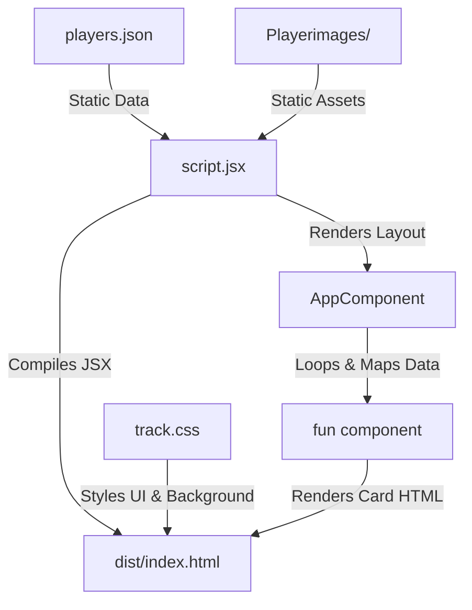

# Famous Tekken Characters Application

A premium, interactive single-page React web application showcasing iconic Tekken 8 characters. The project utilizes a modern glassmorphic UI design, featuring dynamic responsive grids, smooth animations, and optimized asset bundling powered by Parcel.

---

## 🚀 How to Run the Project

1. **Install Dependencies:**
   Ensure you have Node.js installed, then run:
   ```bash
   npm install
   ```

2. **Start the Development Server:**
   Run the dev server with Parcel:
   ```bash
   npx parcel index.html
   ```
   *Note: If the default port `1234` is occupied, Parcel will automatically start the server on a random open port (e.g., `http://localhost:59573` or `http://localhost:53549`). Check the terminal output for the correct URL.*

3. **Build for Production:**
   To bundle and optimize the application for deployment:
   ```bash
   npx parcel build index.html
   ```

---

## 🛠️ Bundling with Parcel

[Parcel](https://parceljs.org/) is used as our build tool and asset bundler. Unlike Webpack, it is a **zero-configuration** bundler. Here is how Parcel works in this project:

*   **Entry Point:** Parcel reads `index.html` as the entry point. It scans the HTML for references to styles (`track.css`) and script modules (`script.jsx`).
*   **Compilation & Transpilation:** It processes the React JSX syntax in `script.jsx` and compiles it to browser-compatible ES5/ES6 JavaScript.
*   **Asset Bundling:** Any asset referenced in the code (such as the background image `tekken8.jpg` inside `track.css`, or player images imported using the `url:` prefix in `script.jsx`) is detected by Parcel. Parcel copies these assets to the `dist/` output folder, hashes their names (e.g., `jin.510c13fa.jpg`) to prevent browser cache issues, and rewrites the URLs dynamically in the bundled code.
*   **Hot Module Replacement (HMR):** During development, Parcel watches for any file changes and instantly pushes updates to the browser without requiring a full page refresh.

---

## 🧩 Component Architecture & Data Flow

The project is structured as a single-page React application where data, logic, and styling are decoupled:



### 1. The Data (`players.json`)
Acts as a local database containing details about each Tekken character (Name, Fighting Style, Nationality, Height, Weight, and their corresponding image path).

### 2. The Logic (`script.jsx`)
*   **Static Assets Import:** It statically imports player images using Parcel's `url:` prefix.
*   **Translation Layer (`imageMap`):** Contains an object mapping local paths from the JSON (e.g., `"./Playerimages/jin.jpg"`) to their compiled and bundled URL strings.
*   **`fun` Component:** A functional component that takes character stats and an image URL as props and returns a structured layout (card) for each player.
*   **`AppComponent`:** The root component. It reads character data from `players.json` and maps over the array, rendering a wrapper card for each character.
*   **DOM Injection:** React inserts the generated virtual DOM node into `<div id="root">` inside the HTML.

### 3. The Styling (`track.css`)
Provides the visual layout. It organizes the cards in a responsive Grid (`.players-container`) and styles each individual card (`.player1`) using custom HSL colors, CSS filters, glassmorphic translucency, and transition animations.

---

## ⚠️ Problems Faced & Solutions

During development, several technical challenges were encountered and solved:

### 1. Dynamic Image References in JSON (Bundler Limitation)
*   **Problem:** If you store relative paths (like `"./Playerimages/jin.jpg"`) inside a JSON file and bind them directly to ``, Parcel cannot statically analyze these dynamic strings. Consequently, the images are omitted from the build, and the browser attempts to fetch them at missing routes, leading to broken image tags.
*   **Solution:** We imported each image statically using `import jin from "url:./Playerimages/jin.jpg"` (noting the `url:` prefix required by Parcel 2 to export raw URL strings instead of empty JS objects). We then mapped these imported variables to their JSON keys inside a lookup dictionary (`imageMap`).

### 2. File Name, Spelling, and Casing Mismatches
*   **Problem:** Mismatches existed between files on disk and paths in `players.json`:
    *   *Case Sensitivity:* The file on disk was `Bryan.jpg` (capitalized), but the JSON specified `bryan.jpg` (lowercase). On case-sensitive web hosts or bundlers, this causes a 404.
    *   *Spelling:* The file on disk was `howrang.jpg` (omitted 'a'), but the JSON specified `hwoarang.jpg`.
*   **Solution:** The translation lookup dictionary (`imageMap`) was set up to translate mismatched JSON keys directly to their correct physical file imports (e.g., mapping `"./Playerimages/bryan.jpg"` to `Bryan.jpg`).

### 3. Parcel Dev Server Cache & File-Locking on Windows (ENOENT Error)
*   **Problem:** On Windows systems, when editing files quickly with a running watcher, Node.js/Parcel might try to rewrite a build file that is currently locked by the OS. This throws errors such as:
    ```text
    Error: ENOENT: no such file or directory, unlink '...\Temp\A_Project_Exercise.36110571.js.xxxx.m'
    ```
*   **Solution:** When this occurs, terminate the active Parcel process, clear the `.parcel-cache` and `dist` directories in your project workspace, and restart the compiler:
    ```bash
    npx parcel index.html
    ```
